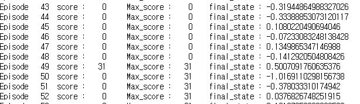
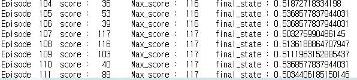

## Mountain Car - Reinforcement Learning
### Environment
- state = [position, velocity]
- action = [left, neutral, right] [0,1,2] 왼쪽으로 가속, 가속하지 않음, 오른쪽으로 가속
- car의 위치는 최소 -1.2 ,  최대 0.6 사이에서 이동가능
- car의 속도는 최소 -0.07, 최대 0.07
- reward는 오른쪽에 위치한 산의 꼭대기 (위치는 0.5) 도착하면 0  그외에는 -1
>가능한 빠르게 깃발에 도착하는 것이 목표, 각 step마다 -1의 reward를 받기 때문에 빠르게 깃발에 도착하는 것이 중요하다.
- episode는 200 step으로 제한
- 초기위치는 -0.6에서 -0.4 사이에서 랜덤하게 설정
- 초기속도는 0으로 설정

### reward 설정
#### 처음에는 성공시에만 reward를 100으로 설정
- episode 200이 되도 성공하지 못했다.

#### 다음과 같은 상황일 때 reward를 +1로 설정
1. 앞으로 가고있을 때 action = 전진
2. 뒤로 가고있을 때 action = 후진


#### episode 22에서 처음 성공함을 보인다. 


#### reward = 2로 설정




#### final result


```python
import random
import gymnasium as gym
import numpy as np
from keras.models import Sequential
from keras.layers import Dense
from keras.optimizers import Adam
import math


model = Sequential() 
model.add(Dense(32, input_dim=2, activation='relu'))
model.add(Dense(16, activation='relu'))
model.add(Dense(16, activation='relu'))
model.add(Dense(3, activation='linear'))
model.compile(loss='mse', optimizer=Adam(learning_rate=0.001), metrics=['accuracy'])

env = gym.make("MountainCar-v0")


FORCE = 0.001
GRAVITY = 0.0025
EPISODES = 1000
TIME_LIMIT = 200
EPSILON = 0.98
memory = []
scores = []
batch_size = 32
Max_score = 0
final_state = 0


for episode in range(EPISODES):
    
    state , _ = env.reset()
    score = 200
    EPSILON = 0.95 * EPSILON


    for t in range(TIME_LIMIT):
        if len(memory) > 40:
            memory.pop(0)


        if np.random.rand() <= EPSILON:
            action = env.action_space.sample()
        else:
            action = np.argmax(model.predict(np.array([state]), verbose=0))
        

        
        next_state, reward, terminated, truncated, _ = env.step(action)
        
        finished = 0
        if next_state[0] >= 0.5:
            finished = 1
            
        # velocity = velocity + (action - 1)*FORCE - math.cos(math.radians(3 * location)) * GRAVITY
        # location = location + velocity
        if finished:
            reward = 100
        elif (next_state[0] >= state[0]) and (action == 2):
            reward = 2
        elif (next_state[0] < state[0]) and (action == 0):
            reward = 2
        else:
            reward = -1
        memory.append((state, action, reward, next_state, finished))


        if len(memory) > batch_size:
            minibatch = random.sample(memory, batch_size)
            states = np.array([x[0] for x in minibatch])  # 32 x 2 어레이
            actions = np.array([x[1] for x in minibatch])  # 32 x 3 어레이
            rewards = np.array([x[2] for x in minibatch])  # 32 x 1 어레이
            next_states = np.array([x[3] for x in minibatch])  # 32 x 2 어레이
            dones = np.array([x[4] for x in minibatch])  # 32 x 1 어레이 (done이면 1, 아니면 0)

            target_y = model.predict(states, verbose=0)
            target_y[range(32), actions] = rewards + (1 - dones) * 0.95 * np.max(model.predict(next_states, verbose=0), axis=1)
            model.fit(states, target_y, epochs=1, verbose=0)
        
        state = next_state
        final_state = state[0]
        score -= 1
        if finished:
            break
    if score > Max_score:
        Max_score = score
    env.close()
    print("Episode {:4d}  score : {:4d}     Max_score : {:4d}    final_state : {}".format(episode, score,Max_score, final_state))
```

### define model

```python
import random

import gymnasium as gym
import numpy as np

import tensorflow as tf

from keras import Model
from keras.layers import Dense


class DQN(Model):
    def __init__(self, state_size, action_size):
        super(DQN, self).__init__()

        self.replay_memory = []

        self.dense1 = Dense(48, activation="tanh", input_dim=state_size)
        self.dense2 = Dense(action_size, activation="softmax")

    def call(self, x):
        x = self.dense1(x)
        return self.dense2(x)
    
    
    def remember(self, state, action, reward, next_state, done):
        self.replay_memory.append((state, action, reward, next_state, done))
        
        
def update_model(model: DQN):
    # 리플레이 버퍼 크기가 작으면 업데이트하지 않음
    if len(model.replay_memory) < 1000:
        return
    
    # 너무 많으면 리플레이 버퍼 pop
    if len(model.replay_memory) > 20000:
        model.replay_memory.pop(0)

    # 메모리에서 랜덤 샘플링
    samples = random.sample(model.replay_memory, 64)

    # 분할
    states, actions, rewards, next_states, dones = zip(*samples)
    # states, actions, rewards, next_states, dones = zip(*model.replay_memory)

    # numpy 배열로 변환
    states = np.array(states)
    actions = np.array(actions)
    rewards = np.array(rewards)
    next_states = np.array(next_states)
    dones = np.array(dones)

    # 모델 예측
    q_values = model.call(states).numpy()
    next_q_values = model.call(next_states).numpy()

    # 타겟 값 계산
    targets = q_values.copy()
    targets[np.arange(len(rewards)), actions] = rewards + 0.99 * np.max(next_q_values, axis=1) * (1 - dones)

    # 모델 업데이트
    with tf.GradientTape() as tape:
        q_values = model.call(states)
        loss = tf.keras.losses.mean_squared_error(targets, q_values)

    gradients = tape.gradient(loss, model.trainable_variables)
    optimizer = tf.keras.optimizers.Adam(learning_rate=0.001)
    optimizer.apply_gradients(zip(gradients, model.trainable_variables))
    
    
env = gym.make("MountainCar-v0")
# env = gym.make("MountainCar-v0", render_mode="human")
model = DQN(env.observation_space.shape[0], env.action_space.n)

for episode in range(50):
    state, info = env.reset()
    terminated = False
    truncated = False
    step = 0
    
    max_score = state[0]
    
    while not terminated and step < 1000:

        # 모델로 행동 예측
        q_values = model.call(np.array([state])).numpy()[0]
        
        # 소프트맥스 확률로 행동 선택
        action = np.random.choice(env.action_space.n, p=q_values)

        # 행동 실행
        next_state, reward, terminated, truncated, info = env.step(action)
        max_score = max(max_score, next_state[0])

        if next_state[1] > 0 and action == 2:
            reward = 5
        elif next_state[1] < 0 and action == 0:
            reward = 5
        if terminated:
            reward = 100

        # 리플레이 버퍼에 기억
        model.remember(state, action, reward, next_state, terminated)
        
        # 모델 업데이트
        update_model(model)

        state = next_state
        step += 1
    
    print("Episode: {}, Steps: {}, Max Score: {}".format(episode, step, max_score))

env.close()
model.save_weights('mountaincar2', save_format='tf')
```
